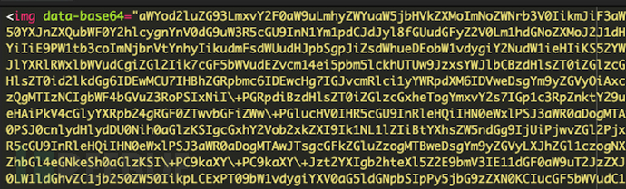

# 利用图片标签窃取信息

# MageCart恶意软件的新伎俩：窃取信用卡信息

## 概述

网络安全研究人员近期发现了一种窃取信用卡信息的恶意软件活动，该活动主要针对运行Magento的电商网站。为了逃避检测，攻击者将恶意内容隐藏在HTML代码的图片标签中。

## MageCart简介

MageCart是一种专门从在线购物网站窃取敏感支付信息的恶意软件。此类攻击通常会利用客户端或服务器端的技术手段，通过植入信用卡信息窃取程序来实施盗窃。通常情况下，这种恶意软件会在用户访问结账页面输入信用卡信息时被触发或加载，要么通过展示虚假表单，要么实时捕获受害者输入的信息。

“MageCart”这一名称来源于这些网络犯罪组织的原始目标——为在线零售商提供结账和购物车功能的Magento平台。多年来，此类攻击活动通过编码和混淆技术，将恶意代码隐藏在看似无害的资源中，如假图片、音频文件、网站图标，甚至是404错误页面。

## 利用Onerror事件执行恶意代码

Sucuri研究员Kayleigh Martin表示：“在这种情况下，影响客户端的恶意软件的目标同样是保持隐蔽。它通过将恶意内容隐藏在HTML的``标签中来达到这一目的，使其容易被忽略。”

与普通的``标签不同，此次攻击中的``标签充当了诱饵，其中包含指向JavaScript代码的Base64编码内容。当检测到onerror事件时，该代码就会被激活。这种攻击方式更加隐蔽，因为浏览器默认信任onerror函数。

Martin解释说：“如果图片加载失败，onerror函数会触发浏览器显示一个破损的图片图标。然而，在此次攻击中，onerror事件被劫持以执行JavaScript代码，而不仅仅是处理错误。”

此外，攻击者还利用了`` HTML元素的“无害性”来增加攻击的成功率。恶意软件会检查用户是否处于结账页面，并等待毫无戒备的用户点击提交按钮，从而将他们输入的敏感支付信息窃取到外部服务器。

### 恶意脚本的设计目的

恶意脚本的设计目的是动态插入一个包含三个字段（卡号、有效期和CVV）的恶意表单，并将窃取的信息发送到wellfacing[.]com。

Martin补充道：“攻击者通过这个恶意脚本实现了两个令人印象深刻的目标：一是将恶意脚本编码到``标签中以规避安全扫描器的检测，二是确保最终用户在恶意表单被插入时不会注意到异常变化，从而尽可能长时间地保持隐蔽。”

## 针对电商平台的持久性攻击

针对Magento、WooCommerce、PrestaShop等平台的攻击者，其目标是尽可能长时间地不被发现。他们注入网站的恶意软件通常比影响其他网站的常见恶意软件更为复杂。

与此同时，网络安全公司还详细披露了一起涉及WordPress网站的事件。攻击者利用mu-plugins（或必用插件）目录植入后门，并以隐蔽方式执行恶意PHP代码。

Puja Srivastava指出：“与常规插件不同，必用插件在每次页面加载时都会自动加载，无需激活或出现在标准的插件列表中。攻击者利用此目录来保持持久性并规避检测，因为放置在此处的文件会自动执行，并且无法通过WordPress管理面板轻易禁用。”
